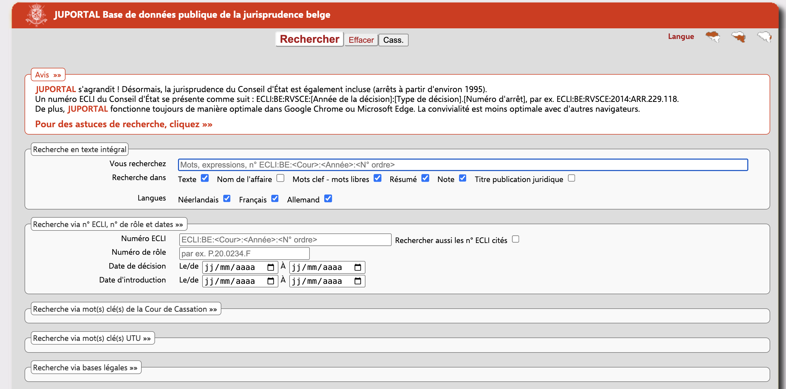
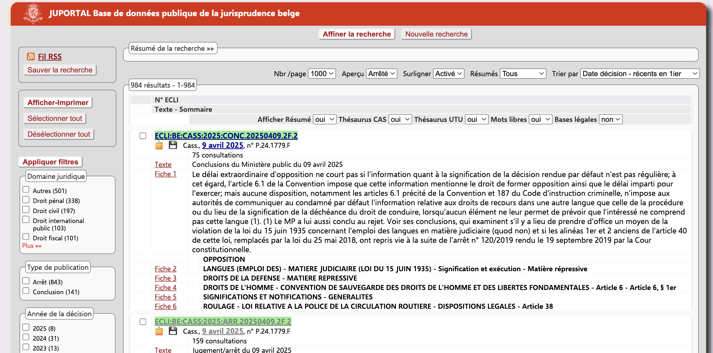
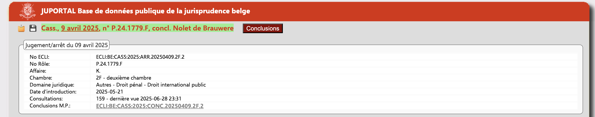
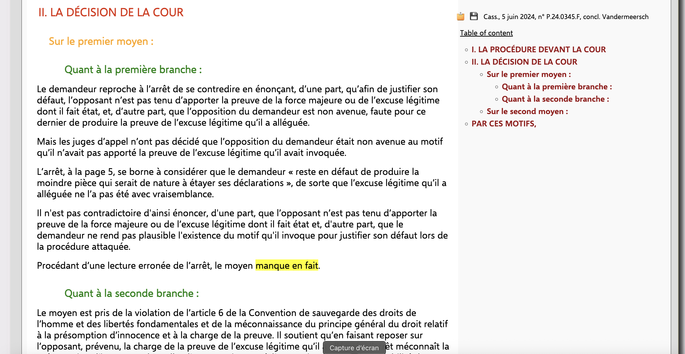

# Better Juportal

This Chrome extension enhances the user experience on [Juportal](https://juportal.be/home/accueil), the portal for the Belgian judiciary. It brings several improvements to the search page, the results page, and the case display page.

It is available for [Chrome](https://chromewebstore.google.com/detail/better-juportal/nbljlhcmlagopgiflnlpaniambjicemc) and for [Firefox](https://addons.mozilla.org/en-US/firefox/addon/better-juportal/).

IMPORTANCE NOTICE: If you are using the Firefox extension, the first time you will surf to Justel website, a blue dot will appear on the icon of the extension. You must right-click on the extension icon and grant it permission to always run on juportal.be. Otherwise, the extension will not work.

# Features

## Search Page

- **Saved Searches Displayed by Default**: Your saved searches are immediately visible, no need to click to show them.
- **Quick Text Selection**: Clicking in the text search field automatically selects all the content for faster editing.
- **Enhanced Search Buttons**: The main search buttons are enlarged and centered for better visibility.
- **"Cass." Search Button**: A new "Cass." button is added to allow for a quick search limited to decisions of the Court of Cassation.

## Results Page

- **Quick Actions**: Each result has new buttons to quickly copy the case reference to the clipboard or to download the decision. When an opinion of the advocate general is available, the downloaded file automatically merges it with the case to which it relates.
- **Smart Reference Copying**: You can select a portion of the summary and the case reference will be automatically appended when you copy it.
- **Standardized French Language**: All links to decisions open by default the French version if available.
- **Court of Cassation Case Enhancements**:
    - **Clear Referencing**: Decisions from the Court of Cassation are presented with a clear, standardized reference (e.g., `Cass., 28 juin 2025, n° P.25.1234.F`).
    - **Color-Coded Cases**: The background of the result is color-coded based on the nature of the case (`P`, `C`, `F`, `S`, `D`), making it easy to identify it at a glance.
    - **Advocate General's Opinion**: Links to the opinion of the Advocate General are highlighted in dark blue.
- **Performance**: The extension uses modern browser features to apply these enhancements efficiently, without slowing down the page load.

## Case Page

- **Improved Readability**:
    - The layout is cleaned up by hiding unnecessary buttons.
    - The text of the decision is displayed with a larger font and an optimized width for easier reading.
    - Headings within the decision are styled with different colors and margins, creating a clear visual structure.
- **Table of Contents**: A floating table of contents is generated for long decisions, allowing for easy navigation between sections.
- **Court of Cassation Case Enhancements**:
    - **Complete, Clickable Reference**: A full reference is displayed at the top of the page, including the date, case number, and a link to the Advocate General's opinion if available. The reference is clickable to easily navigate back to the decision's page.
    - **Smart Copying**: Copying text from the decision will automatically include the full case reference. You can also copy the reference alone by clicking the copy button.
    - **PDF Download**: A download button allows you to save the decision as a PDF file, with a standardized filename (e.g., `Cass. 2025-06-28 n° P.25.1234.F.pdf`). If an opinion of the Advocate General exists, it is automatically merged with the judgement of the Court.
    - **Pasicrisie Reference**: The extension automatically searches for and displays the reference to the *Pasicrisie* (the official law reports of the Supreme Court) if it is available on the page.
    - **Easy Access to Linked Documents**: If the decision is linked to the Advocate General's opinion (or vice-versa), a button is provided to open the linked document in a new tab.
    - **Advocate General Information**: The name of the Advocate General is fetched and displayed.
    - **Semantic Structuring**: For judgments of the Court of Cassation, the extension identifies and highlights key parts of the text, such as the legal provisions, the contested decision, and - with some basic logic - the Court's central teachings, making the legal reasoning easier to follow.

# Privacy

This extension does not collect, store, or transmit any personal data. All processing occurs locally in your browser, and no information is sent to external servers.

# Credits

- This extension uses the excellent [**pdf-lib**](https://pdf-lib.js.org/) library to create PDF documents.
- [**GitHub Copilot**](https://github.com/features/copilot) was used to review and improve the code.

# Release history
- Version 0.1.2025.630 : first version published
- Version 0.1.2025.715 : hotfix required by slight changes in the structure of the pages of the site
- Version 0.1.2025.717 :
    - hotfix required by the fact that Juportal now redirects to https://juportal.just.fgov.be
    - status message added when the extension is updated
- Version 0.1.2025.724 :
    - current version is now displayed correctly in the extension popup
    - hotfix required by slight changes in the structure of the pages of the site
    - improvement of regex filters for the analysis of the judgment
- Version 0.1.2025.726 :
    - merged Chrome and Firefox manifest.json
    - improved and simplified treatment of results page due to a change in the page structure
    - improved detection of RG when analysing judgments
    - rewritten code to detect the name of the advocate general (taken from the text of the judgement if possible)
- Version 0.1.2025.1117 :
    - improved fade in for status bar
    - fixed a bug preventing merging of judgement and advocate's general opinion when clicking on save button
    - improved highlighting of the case
- Version 0.1.2026.219 :
    - fixed timing issue: the extension now waits for the page content to fully load before applying enhancements, preventing cases where the text would be displayed but not reformatted
    - the first name of the advocate general is now abbreviated in the case reference (e.g. D. Vandermeersch instead of Damien Vandermeersch), with proper handling of composite first names (e.g. J.-M. for Jean-Marie Genicot)
    - improved detection of Dutch heading combinations (e.g. "Tweede en derde onderdeel") as heading level 3
    - "Sur le premier rameau" and similar combinations are now detected as h4 headings
    - "Par ces énonciations" and "Ce faisant" are now highlighted with a green background as key teachings
    - "Uit voormelde bepalingen in hun onderlinge samenhang volgt" is now highlighted with a green background
    - fixed advocate general name detection for judgments where the AG deposited conclusions using alternative phrasings (e.g. "a déposé au greffe des conclusions", "conclusie neergelegd ter griffie")
    - fixed wrong advocate general detection when the AG present at the hearing differs from the one who wrote the conclusions
    - "niet ontvankelijk" and "irrecevable" are now highlighted even when not immediately followed by a period
    - fixed a false positive where paragraphs starting with a number and containing the word "grief" were wrongly detected as headings
    - for advocate general conclusions, endnotes are now displayed in a sticky sidebar in the right margin, allowing to consult them while reading the conclusion without scrolling back and forth